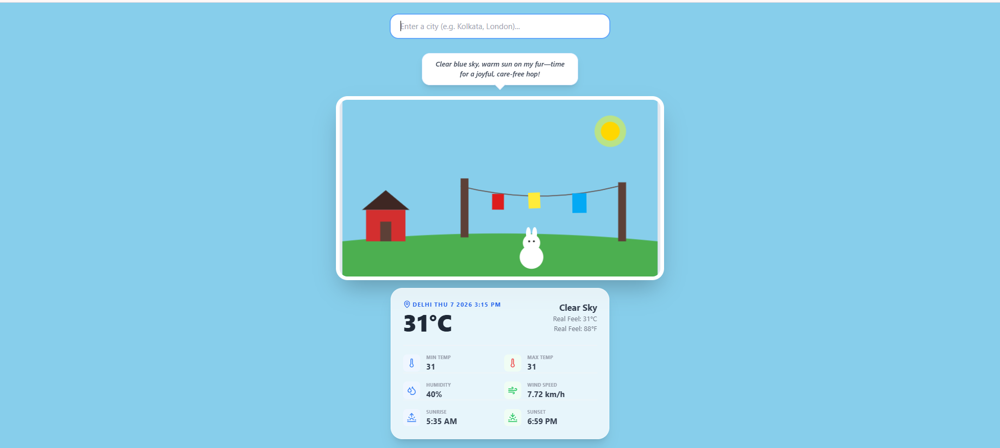
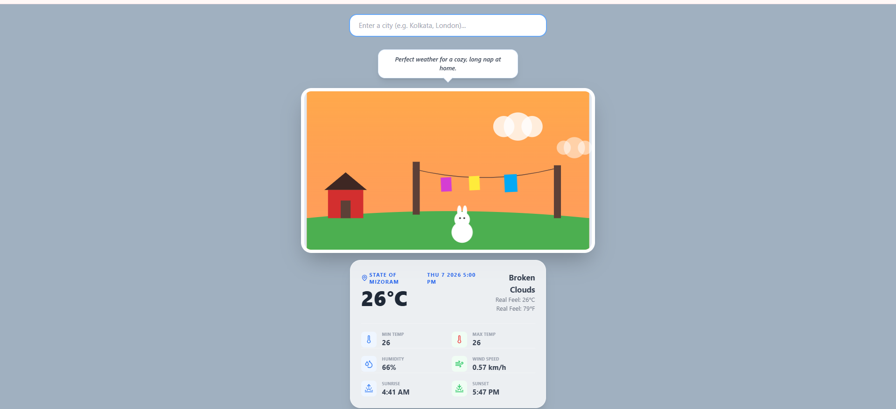
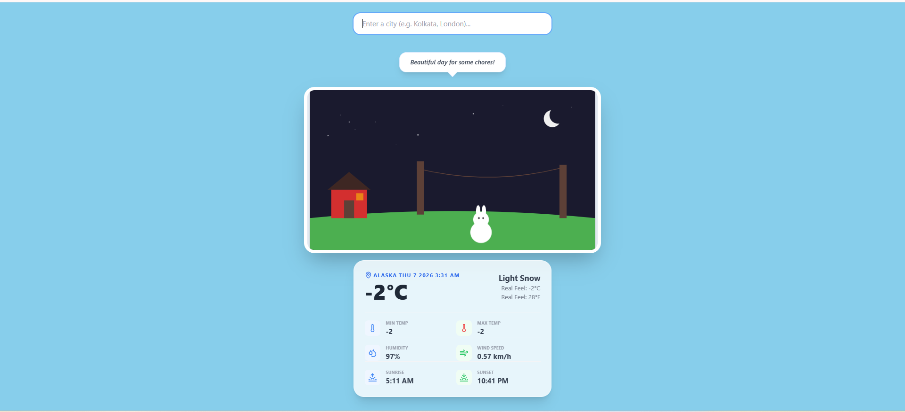
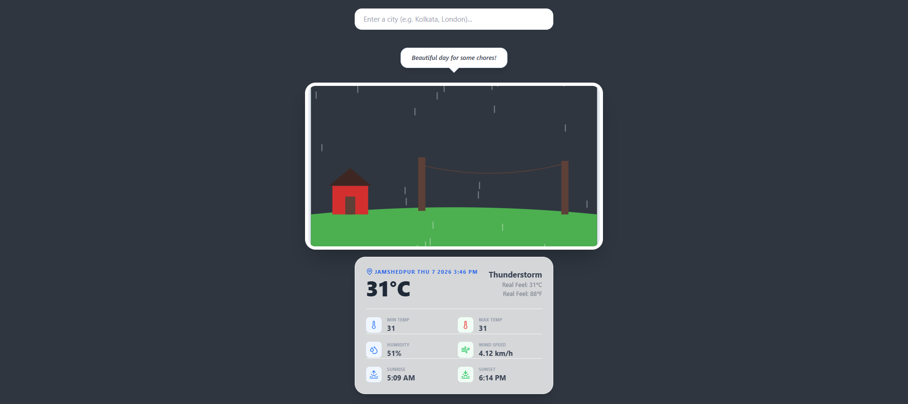
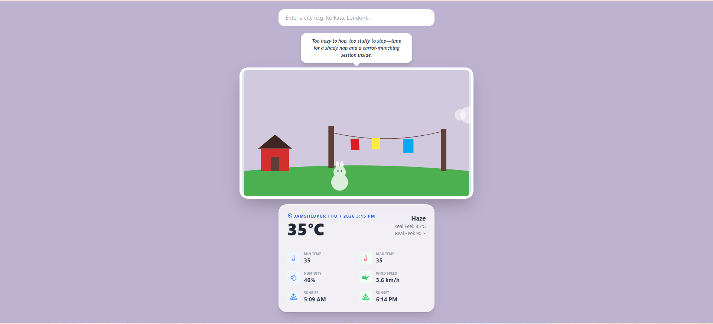

# 🐰 Bunny Weather: An AI-Driven Atmospheric Experience

Bunny Weather is a modern, reactive weather application that blends real-time meteorological data with a storytelling UI. It features an interactive SVG environment where a **Bunny** reacts to the weather, time of day, and wind conditions, narrated by a custom **AI personality** powered by Google Gemini.

---

## ✨ Features

*   **🌍 Real-Time Weather:** Integration with OpenWeatherMap API for global weather data.
*   **🤖 AI Narration:** Dynamic, witty internal monologues for the Bunny based on current weather states, generated by **Google Gemini 2.5 Flash**.
*   **🎭 Reactive SVG Canvas:** 
    *   **Day/Night Logic:** Sky transitions to indigo with stars and house lights during nighttime.
    *   **Golden Hour:** A warm peach sky and golden overlay appear 1 hour before sunset.
    *   **Dynamic Wind:** Clothes on the line swing faster or slower based on real-world wind speeds.
    *   **Weather States:** Unique visuals for Rain, Haze, Mist, Clouds, and Storms.
*   **📍 Auto-Geolocation:** Automatically detects user city using reverse geocoding.
*   **⚡ Modern Tech Stack:** Built with React, Vite, Tailwind CSS, and Framer Motion.

---

## 🛠️ Tech Stack

*   **Framework:** React (Vite)
*   **Styling:** Tailwind CSS
*   **Animations:** Framer Motion
*   **Icons:** Lucide React
*   **AI:** Google Generative AI SDK (Gemini API)
*   **Data:** OpenWeatherMap API

---

## 🚀 Getting Started

### Prerequisites
*   Node.js (v18+)
*   An API Key from [OpenWeatherMap](https://openweathermap.org/api)
*   An API Key from [Google AI Studio](https://aistudio.google.com/)

### Installation

1. **Clone the repository:**
   ```bash
   git clone [https://github.com/your-username/bunny-weather-app.git](https://github.com/your-username/bunny-weather-app.git)
   cd bunny-weather-app

2. **Install dependencies:**
    npm install

3. **Set up Environment Variables:**
  * Create a .env file in the root directory:

  VITE_OPENWEATHER_KEY=your_openweather_key
  VITE_GEMINI_KEY=your_gemini_key


4. **Run the development server:**
    npm run dev
  
## 📐 Project Structure
```text
src/
├── components/
│   ├── WeatherCanvas.jsx   # Reactive SVG Scene (Bunny, Sky, House)
│   ├── WeatherCard.jsx     # Data Dashboard (Temp, Wind, Humidity)
│   └── AINarrator.jsx      # AI Speech Bubble for Bunny thoughts
├── hooks/
│   ├── useWeather.js       # OpenWeather API & Geolocation logic
│   └── useAINarrator.js    # Google Gemini AI integration & fallback thoughts
├── utils/
│   ├── weatherMapping.js   # Maps API conditions to Bunny visual states
│   ├── timeUtils.js        # Logic for Day/Night and Golden Hour checks
│   ├── weatherDateTime.js  # Formatting: "Thu 7 2026 4:18 PM" & Timezone offsets
│   └── conversions.js      # Metric to Imperial (Celsius to Fahrenheit) logic
└── App.jsx                 # Main Orchestrator & State Manager


## 📸 App Preview

| Sunny Afternoon | Golden Hour | Night Time |
| :---: | :---: | :---: |
|  |  |  |

| Rainy Weather | Haze/Mist State |
| :---: | :---: |
|  |  |

📄 License
Distributed under the MIT License.

🙌 Acknowledgments
Bunny Inspiration: Created for developers who love clean SVGs and cozy vibes.

Google Gemini: For providing the "brains" behind the bunny.

